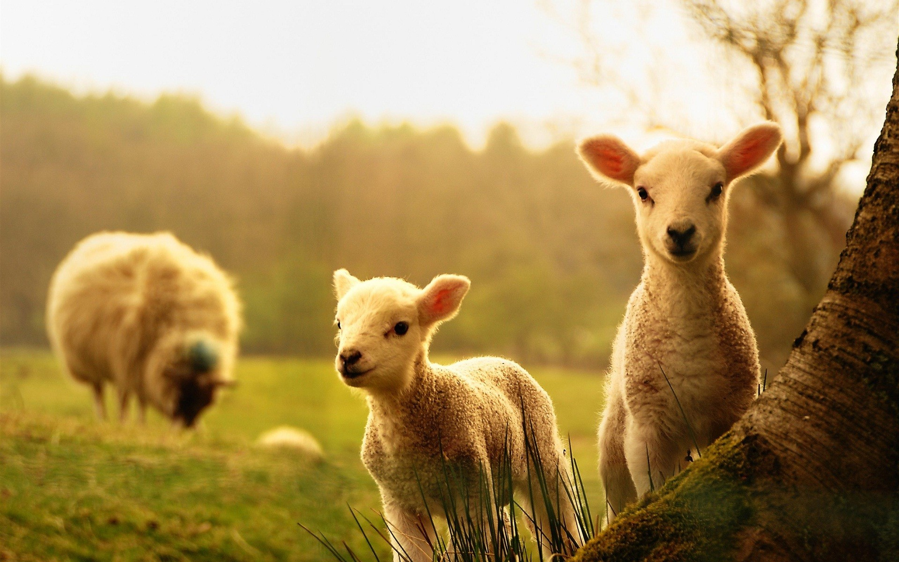

## Happy Birthday!
<head>
  <link rel = "stylesheet" type = "text/css" href = "css/style.css" />
</head>

    <figure>
        
    </figure>
    <figure>
        
    </figure>
    <figure>
         
    </figure>

