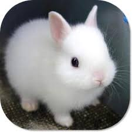

## Happy Birthday!
<head>
  <link rel = "stylesheet" type = "text/css" href = "style.css" />
</head>

    <figure>
        
        <figcaption>Caption goes here</figcaption> 
    </figure>

    <!-- more figures here as needed -->

